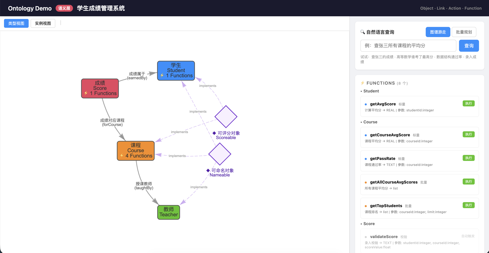

# Ontology Semantic Layer Demo

A student grade management system demo built on **Palantir Ontology** design principles. Raw SQLite tables (student/teacher/course/score) are wrapped into an Ontology semantic layer of Object/Link/Action/Function, exposing business semantics rather than SQL to upper layers.

**Core philosophy**: LLMs and applications only perceive business objects (Student, Course, Score) — they never touch raw table schemas.



## Quick Start

```bash
# 1. Install dependencies
pip install fastapi uvicorn httpx

# 2. Initialize database and load seed data
python seed_data.py

# 3. Start the server
python server.py
```

Visit http://localhost:8000 for the frontend graph UI, http://localhost:8000/docs for Swagger API docs.

## Architecture

```
SQLite Raw Tables (student / teacher / course / score)
        │
        ▼  Mapping config (registry.py)
Ontology Semantic Layer
  ├── Object Types:  Student, Teacher, Course, Score
  ├── Link Types:    earnedBy, forCourse, taughtBy
  ├── Action Types:  createScore, updateScore, deleteScore, assignTeacher
  ├── Functions:     getAvgScore, getTopStudents, getPassRate ...
  ├── Interfaces:    Nameable, Scoreable
  └── Object Sets:   TopStudents, PassedCourses
        │
        ▼  Exposure (server.py)
┌──────────────────────────────────────────────────────────┐
│  REST API    │  Frontend Graph │      NL Query            │
│  CRUD endpoints │  vis.js       │  OAG Mode (recommended) │
│  /docs       │  Force-directed │  + Graph Walk + Batch   │
└──────────────────────────────────────────────────────────┘
```

## Core Concepts

### Five-Element Model

| Concept | Role | Example |
|---------|------|---------|
| **Object Type** | Business entity (noun) | Student, Course |
| **Link Type** | Entity relationship (verb) | earnedBy (who the score belongs to), taughtBy (who teaches it) |
| **Action Type** | Write operation (imperative) | createScore (record a grade) |
| **Function** | Computation & reasoning | getAvgScore (calculate average) |
| **Interface** | Cross-object capability contract | Nameable (searchable by name) |
| **Object Set** | Named collection of objects (predefined business rules) | TopStudents (avgScore >= 85) |

### Three Property Types

| Type | Description | Example |
|------|-------------|---------|
| Primary Key | Unique identifier | `id` |
| Regular | Stored business field | `name`, `age`, `credit` |
| Derived | Dynamically computed by Function | `avgScore`, `passRate` |

### Action Execution Pipeline

```
Param validation → Business validation → Transactional execution → Audit log → Commit/Rollback
```

All writes must go through Actions. Direct table writes are forbidden.

## Natural Language Query

Three NL query modes, representing different architectural approaches.

### OAG Mode `POST /ontology/nl-query-oag` (Recommended)

**Ontology Augmented Generation (OAG) Mode**: The LLM declares query intent at the object type level, and the engine automatically compiles SQL JOINs based on Link definitions. **The LLM never touches instance data or traversal logic.**

This aligns with [Palantir AIP's OAG](https://www.palantir.com/docs/foundry/ontology/ontology-augmented-generation): the Ontology serves as a constraint system — the LLM only understands user intent and fills parameters, without orchestrating query execution paths.

| Tool | Function | vs. Traditional |
|------|----------|-----------------|
| `query_objects` | **Core**: Cross-link dot-notation filter. e.g. `type="Score", filters={"student.name":"Zhang", "course.name":"Math"}` → engine auto-JOINs tables | Replaces multi-step search + traverse |
| `query_object_set` | Query a predefined ObjectSet (e.g. TopStudents) | New capability |
| `list_object_types` | List all types + ObjectSets + relationships | Added ObjectSet info |
| `get_object_detail` | Get full object details | Takes `(type, id)` instead of `(node_key)` |
| `call_function` | Invoke compute functions | Same |
| `execute_action` | Execute write operations | Same |

**Key difference**: No `traverse` tool. Link traversal moves from the LLM's decision space into the engine's compilation space. Query results automatically include derived properties (avgScore, passRate).

### Graph Walk Mode `POST /ontology/nl-query-graph`

The LLM explores the **instance graph** step-by-step through 7 graph-native tools. Useful for comparison and understanding how LLM agents navigate graphs.

### Batch Planning Mode `POST /ontology/nl-query`

The LLM outputs a complete JSON operation sequence. The engine executes sequentially.

### Query Comparison

| Query | OAG Mode (Recommended) | Graph Walk Mode |
|-------|----------------------|-----------------|
| "Zhang San's Advanced Math score" | **1 step**: `query_objects(Score, {student.name, course.name})` | 8 steps: search → traverse scores → traverse each to course |
| "Who are the top students?" | **1 step**: `query_object_set("TopStudents")` | Not supported (no ObjectSet) |
| "Zhang San's average score" | **1 step**: `query_objects(Student, {name})`, avgScore included | 2 steps: search → call_function |
| "What types are available?" | 1 step: `list_object_types` | 1 step: `list_object_types` |

## API Endpoints

### Schema Metadata

| Method | Path | Description |
|--------|------|-------------|
| GET | `/ontology/schema` | Full Schema definition (frontend graph + LLM tool definitions) |
| GET | `/ontology/graph/schema` | Type-level graph (Object Types + Link Types) |
| GET | `/ontology/graph` | Full instance graph data (nodes + edges) |
| GET | `/ontology/interfaces` | All Interface definitions |

### Object Queries

| Method | Path | Description |
|--------|------|-------------|
| GET | `/ontology/objects/{type}` | Query objects (fuzzy name match, sorting, pagination) |
| GET | `/ontology/objects/{type}/{id}` | Get single object (with derived properties) |
| GET | `/ontology/objects/{type}/{id}/links/{link}` | Traverse Link to get related objects |

### Compute & Actions

| Method | Path | Description |
|--------|------|-------------|
| GET | `/ontology/functions/{funcName}` | Call a Function |
| POST | `/ontology/actions/{actionName}` | Execute an Action |

### ObjectSet

| Method | Path | Description |
|--------|------|-------------|
| GET | `/ontology/object-sets` | List all ObjectSet definitions |
| GET | `/ontology/object-sets/{name}` | Query objects in an ObjectSet |

### Natural Language Query

| Method | Path | Description |
|--------|------|-------------|
| POST | `/ontology/nl-query-oag` | **OAG Mode (recommended)** — type-level query with engine-compiled JOINs |
| POST | `/ontology/nl-query-graph` | Graph Walk mode — LLM agent explores instance graph |
| POST | `/ontology/nl-query` | Batch Planning mode — LLM outputs JSON operation sequence |

## Project Structure

```
ontology/
├── server.py                       # FastAPI entry point
├── seed_data.py                    # Seed data (3 teachers, 5 courses, 5 students, 20 scores)
├── static/
│   └── index.html                  # Single-page frontend (vis.js force-directed graph + NL query)
├── ontology_engine/
│   ├── schema.py                   # Core dataclass definitions
│   ├── registry.py                 # Mapping config hub (Object/Link/Action/Function/ObjectSet)
│   ├── database.py                 # SQLite connection management + table creation
│   ├── graph.py                    # In-memory graph engine (adjacency list, O(1) traversal)
│   ├── query.py                    # Query engine (semantic operations → SQL translation)
│   ├── action.py                   # Action engine (validation → transaction → audit)
│   └── functions.py                # Function engine (SQL computation logic)
└── Palantir_Ontology_详解.md       # Palantir Ontology design reference (Chinese)
```

## Adding New Ontology Elements

1. Create table in `database.py:init_db()` (if needed)
2. Add `ObjectTypeDef` / `LinkTypeDef` / `FunctionDef` / `ActionTypeDef` in `registry.py`
3. New Function → add logic in `functions.py:call_function()`
4. New Action → add logic in `action.py:_run_action()`
5. The graph engine auto-reads from registry and builds the graph structure
6. Add seed data in `seed_data.py`

## Environment Variables

| Variable | Description | Default |
|----------|-------------|---------|
| `ANTHROPIC_BASE_URL` | LLM API URL | `https://api.deepseek.com/anthropic` |
| `ANTHROPIC_AUTH_TOKEN` | LLM API key | — |
| `ANTHROPIC_MODEL` | Model name | `deepseek-v4-pro[1m]` |

## Contributions Welcome

This is an open community project — anyone interested is welcome to contribute! Whether you are a:

- **Learner**: Curious about Ontology semantic layer concepts and want to learn through real code
- **Developer**: Want to add new Object/Link/Action/Function types or improve existing implementations
- **Researcher**: Have deep insights into Palantir Ontology design principles and want to share your understanding
- **User**: Found a bug or have feature suggestions

### How to Contribute

- **Issues**: Discussions on Ontology design philosophy, architecture improvements, feature requests
- **Pull Requests**: Code improvements, new features, documentation, bug fixes
- **Ideas**: Share your thoughts on Ontology semantic layers, OAG (Ontology Augmented Generation), AI Agent + Knowledge Graph integration in Discussions

All contributors will be credited in the project's contributor list.

## References

- [Palantir Foundry - Ontology Overview](https://www.palantir.com/docs/foundry/ontology/overview/)
- [Building with Palantir AIP: Data Tools for RAG/OAG](https://blog.palantir.com/building-with-palantir-aip-data-tools-for-rag-oag-b3b509c8b0f3)
- [Building with Palantir AIP: Logic Tools for RAG/OAG](https://blog.palantir.com/building-with-palantir-aip-logic-tools-for-rag-oag-fdaf8938d02e)

## Disclaimer

This project is an independent open-source study and implementation of [Palantir Ontology](https://www.palantir.com/docs/foundry/ontology/overview/) design principles. All code is independently written. This project is not affiliated with, sponsored by, or endorsed by Palantir Technologies Inc. in any way. "Palantir" and "Foundry" are trademarks of Palantir Technologies Inc.
